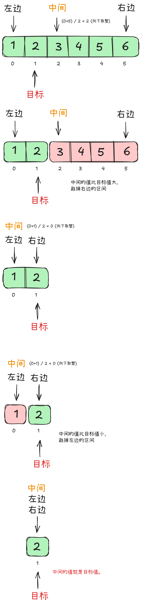

## 二分查找

> 应用于**有序线性表**的高效查找算法

### [704. 二分查找](https://leetcode.cn/problems/binary-search/)

没学习前试了下直接枚举，复杂度是 O(n)，但是 LeetCode 不让这样玩，交上去被扫出来了

```cpp+
class Solution {
public:
    int search(vector<int>& nums, int target) {
        for (int i=0;i<nums.size();i++) {
            if (nums[i]==target) return i;
        }

        return -1;
    }
};
```

学了一下发现其实挺简单的，原理就是每次取中间的数和目标数比较，如果中间数大于目标数，那么目标数只可能在左边，反之亦然，然后一左一右不断缩小范围，直到找到目标数或者范围为空。



AC 代码：

```cpp
class Solution
{
public:
    int search(vector<int> &nums, int target)
    {
        // 定义左右指针
        int left = 0;
        int right = nums.size() - 1;

        // 如果左指针小于等于右指针，说明还有搜索空间，大于则说明没有找到
        while (left <= right)
        {
            // 计算中间位置
            int middle = (right + left) / 2;

            // 中间大说明目标在左边，右指针左移，裁切右半部分
            if (nums[middle] > target)
            {
                right = middle - 1;
            }
            // 中间小说明目标在右边，左指针右移，裁切左半部分 
            else if (nums[middle] < target)
            {
                left = middle + 1;
            }
            // 中间等于目标说明找到了，返回中间位置
            else if (nums[middle] == target)
            {
                return middle;
            }
        }

        // 没有找到目标数，返回 -1
        return -1;
    }
};
```

- 时间复杂度：O(log n)
- 空间复杂度：O(1)

> [!WARNING]
> 使用二分查找的前提是数组必须是有序的，如果数组无序，必须先排序再使用二分查找。  
> 如果数组中有重复元素，二分查找只能找到其中一个目标值的位置，不能保证找到所有目标值的位置。

### [35. 搜索插入位置](https://leetcode.cn/problems/search-insert-position/)

AC 代码：

```cpp
class Solution
{
public:
    int searchInsert(vector<int> &nums, int target)
    {
        // 前半部分就是正常二分查找
        int left = 0;
        int right = nums.size() - 1;
        int middle = 0;
        while (left <= right)
        {
            middle = (left + right) / 2;
            if (nums[middle] > target)
            {
                right = middle - 1;
            }
            else if (nums[middle] < target)
            {
                left = middle + 1;
            }
            else
            {
                return middle;
            }
        }

        // 后半部分插入这里比较绕
        
        // 如果目标数小于中间数
        // 说明目标数应该插入到中间数的前面
        if (nums[middle] > target)
        {
            // 插入后，插入数会替代中间数的位置
            // 所以返回中间数的位置
            return middle;
        }
        // 如果目标数大于中间数
        // 说明目标数应该插入到中间数的后面
        else
        {
            // 插入数会插入到中间数的后面
            // 所以返回中间数的位置 + 1
            return middle + 1;
        }
    }
};
```

- 时间复杂度：O(log n)
- 空间复杂度：O(1)

另一种思路：

```cpp
class Solution
{
public:
    int searchInsert(vector<int> &nums, int target)
    {
        // 前面不变
        // 感觉更烧脑子了...
        ...
        
        // 分别处理如下三种情况
        // 目标值在数组所有元素之前  [0, -1]
        // 目标值插入数组中的位置 [left, right]，return  right + 1
        // 目标值在数组所有元素之后的情况 [left, right]， 因为是右闭区间，所以 return right + 1
        return right + 1;
    }
};
```

### [34. 在排序数组中查找元素的第一个和最后一个位置](https://leetcode.cn/problems/find-first-and-last-position-of-element-in-sorted-array/)

