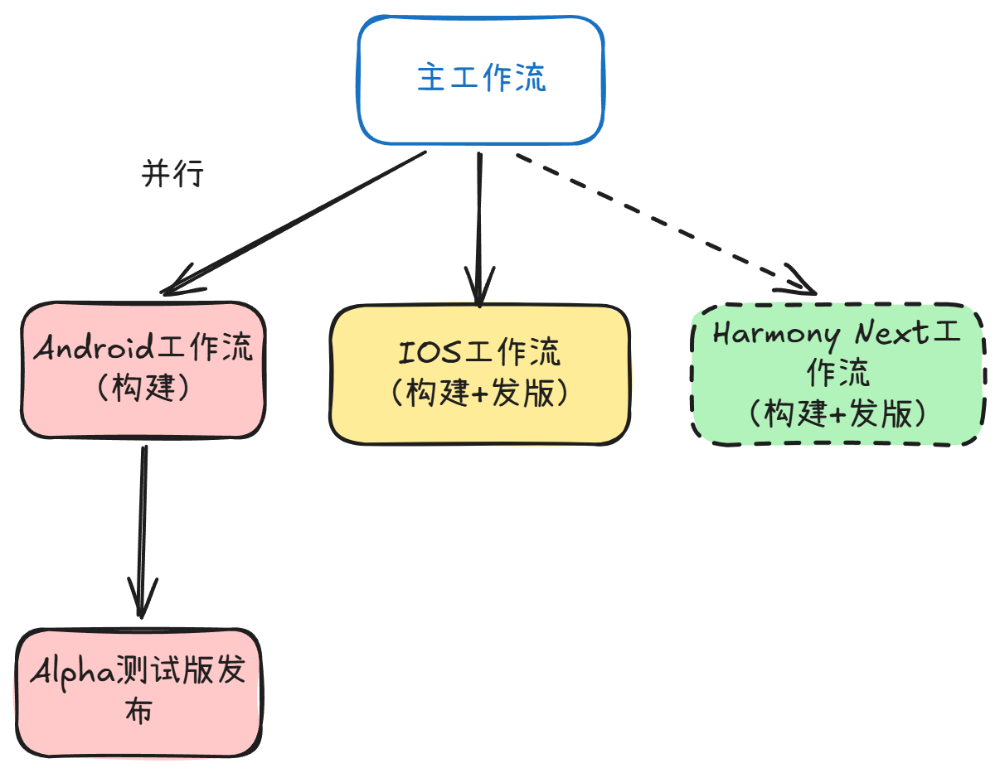
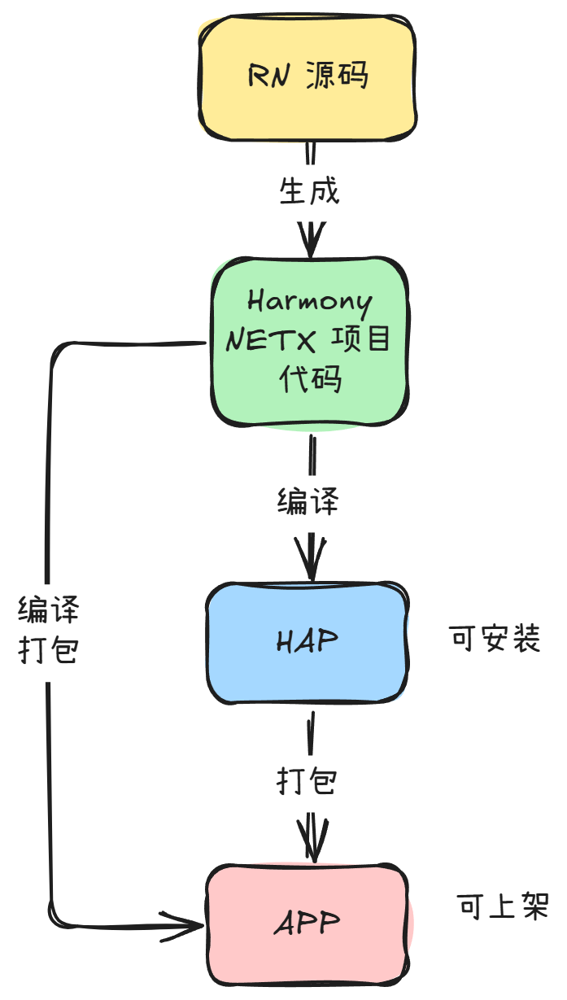

## 背景  

学长大人 [@renbaoshuo](https://github.com/renbaoshuo) 给[福uu](https://fzuhelperapp.west2.online/)（React Native、Expo）适配了 Harmony NEXT，需要配套的 GitHub 工作流来自动化构建



我们的CI/CD入口点在 main.yml（主工作流） 中，然后使用 workflow_call 调用其他工作流。我们要做的就是加上一条 Harmony NEXT 的构建工作流，来实现自动化构建、发版。

## 软件包构建



### 两种软件包

- HAP （.hap 文件）: Harmony 应用包，类似 Android 的 APK ，不能上架
- APP （.app 文件）: Harmony 发布包，可以上架，但是不能安装，解压后是 HAP 和一些元数据

### 签名

HAP 和 APP 都需要使用 `hap-sign-tool.jar` 签名，只有签名的 HAP 才能被安装，只有签名的 APP 才能被上架

签名要用到 `密钥（.p12文件）`、`数字证书（.cer文件）`、`Profile（.p7b文件）` 三个文件，如何申请可以参考[官方文档](https://developer.huawei.com/consumer/cn/doc/harmonyos-guides/ide-command-line-building-app#section6103553181714)

拿到这三个文件后，使用 `hap-sign-tool.jar` 对 HAP/APP 进行签名

```bash
java \
  -jar $HOS_SDK_HOME/default/openharmony/toolchains/lib/hap-sign-tool.jar sign-app \
  -keyAlias "密钥别名" \
  -signAlg "SHA256withECDSA" \
  -mode "localSign" \
  -appCertFile "数字证书（.cer文件）路径" \
  -profileFile "Profile（.p7b文件）路径" \
  -inFile "输入路径" \
  -keystoreFile "密钥（.p12文件）路径" \
  -outFile "输出路径" \
  -keyPwd "密钥密码" \
  -keystorePwd "密钥库密码"
```

> [!NOTE]
> `$HOS_SDK_HOME` 是 HarmonyOS SDK 的安装路径  

### 打包 （不推荐）

构建 HAP 后，同级目录会有一个 `pack.info` 文件，里面包含了 HAP 的元数据，使用 `app_packing_tool.jar` 可以将 HAP 和 `pack.info` 打包成 APP，但是实测自己打包的 APP 无法正常被 AppGallery Connect 识别，所以不推荐自己打包

<details>
  <summary>打包命令</summary>

```bash
java \
  -jar $HOS_SDK_HOME/default/openharmony/toolchains/lib/app_packing_tool.jar \
  --mode app \
  --hap-path "HAP 输入路径" \
  --out-path "APP 输出路径" \
  --pack-info-path "pack.info 路径" \
```

</details>

## 工作流编写

### 工作流框架

```yml
name: Build APP

on:
  workflow_call: # 我们使用 workflow_call 来调用这个工作流

jobs:
  build-app:
    runs-on: ubuntu-latest # 推荐 Linux 系统，对鸿蒙工具链较友好
    timeout-minutes: 60    # 设置超时时间

    steps:
      ...
```

### 环境搭建

```yml
# 签出代码，没啥好说的
- name: Checkout Source Code 
  uses: actions/checkout@v6
  with:
    fetch-depth: 0 # 禁用 fetch-depth，确保可以获取完整的 Git 历史记录用于版本号生成

# 安装 libgl1-mesa-dev，鸿蒙工具链依赖
- name: Install libgl1-mesa-dev 
  run: |
    sudo apt-get update
    sudo apt-get install -y libgl1-mesa-dev

# 安装 HarmonyOS CLI 工具链
# 工作流会自动下载并安装 HarmonyOS CLI 工具链，并将其添加到 PATH 中
# 并且添加相关环境变量 $HOS_SDK_HOME 等
- name: Setup HarmonyOS CLI tools 
  uses: ErBWs/setup-ohos@v2
  with:
    version: 6.1.1.280
    cache: true

# 注意，这个工作流会设置 Node 环境为 Node 16
# 我们项目需要 Node 22，所以要重新安装 Node 22
# 上下两个步骤不能颠倒

# 安装 Node.js
- name: Setup Node.js 
  uses: actions/setup-node@v6
  with:
    node-version: 22
    cache: yarn


# 安装 Java 17
- name: Setup Java
  uses: actions/setup-java@v5
  with:
    distribution: temurin
    java-version: 17

# 安装 Gradle
- name: Setup Gradle
  uses: gradle/actions/setup-gradle@v5
  with:
    cache-encryption-key: ${{ secrets.GRADLE_ENCRYPTION_KEY }} # 用于加密 Gradle 缓存

```

### 安装依赖

`prebuild:harmony`、`oh:install`、`oh:bundle` 这些脚本和 `@react-native-oh` 的 Harmony 适配依赖，都定义在源仓库 [west2-online/fzuhelper-app](https://github.com/west2-online/fzuhelper-app) 里

```yml
# 安装 React Native 项目依赖
- name: Install Dependencies
  run: |
    yarn install --frozen-lockfile --prefer-offline

# 生成 HarmonyNEXT 项目
- name: Prebuild
  run: |
    yarn prebuild:harmony

# 安装 OpenHarmony 依赖
- name: Install OpenHarmony Dependencies
  run: |
    yarn oh:install
    # 包含 ohpm install --all
```

### 构建 APP

```yml
# 构建 Release APP
- name: Build Release APP
  run: |
    yarn oh:bundle
    
    cd harmony
    # 产物类型 assembleApp，模式 project，产品 default，构建模式 release
    hvigorw assembleApp --mode project -p product=default -p buildMode=release --no-daemon

# 签名 APP
- name: Sign APP
  run: |
    cd harmony
    mkdir output

    # 将密钥、证书、Profile 从 Base64 解码为文件
    echo "$SIGN_KEYSTORE_BASE64" | base64 -d > "./release.p12"
    echo "$PROFILE_BASE64" | base64 -d > "./release.p7b"
    echo "$CERT_BASE64" | base64 -d > "./release.cer"

    # 使用 hap-sign-tool.jar 对 APP 进行签名
    java \
      -jar $HOS_SDK_HOME/default/openharmony/toolchains/lib/hap-sign-tool.jar sign-app \
      -keyAlias "$KEY_ALIAS" \
      -signAlg "SHA256withECDSA" \
      -mode "localSign" \
      -appCertFile "./release.cer" \
      -profileFile "./release.p7b" \
      -inFile "./build/outputs/default/harmony-default-unsigned.app" \
      -keystoreFile "./release.p12" \
      -outFile "./output/release.app" \
      -keyPwd "$KEY_PASSWORD" \
      -keystorePwd "$KEYSTORE_PASSWORD"
  env:
    KEYSTORE_PASSWORD: ${{ secrets.OH_SIGN_STORE_PWD }}
    KEY_ALIAS: ${{ secrets.OH_SIGN_ALIAS }}
    KEY_PASSWORD: ${{ secrets.OH_KEY_PWD }}
    SIGN_KEYSTORE_BASE64: ${{ secrets.OH_SIGN_STORE_BASE64 }}
    CERT_BASE64: ${{secrets.OH_CERT_BASE64}}
    PROFILE_BASE64: ${{secrets.OH_PROFILE_BASE64}}
```

### 上传产物

```yml
# 提取版本号信息
- name: Extract Version Info
  id: version-info
  shell: bash
  run: |
    cd harmony
    VERSION_CODE=$(jq -r '.app.versionCode' ./AppScope/app.json5)
    VERSION_NAME=$(jq -r '.app.versionName' ./AppScope/app.json5)
    APP_FILENAME="FzuHelper_${VERSION_NAME}.${VERSION_CODE}.app"

    echo "APP_FILENAME=$APP_FILENAME" >> "$GITHUB_OUTPUT"

# 上传到 AppGallery Connect
- name: Deploy to Huawei App Gallery
  uses: ACaiCat/huawei-appgallery-deploy@v1.3.0
  with:
    # 开发者级 Service Account 认证，credentials 为 JSON 格式
    credentials: ${{secrets.HUAWEI_CREDENTIALS}}
    # 应用在 AppGallery Connect 上的 App ID
    app-id: ${{secrets.HUAWEI_APP_ID}}
    # 上传的文件路径和文件名
    file-path: './harmony/output/release.app'
    # 最后在 AppGallery Connect 上显示的文件名
    file-name: ${{ steps.version-info.outputs.APP_FILENAME }}
    # 是否提交审核
    submit: false

# 上传产物到 GitHub Actions 的 artifacts
- name: Upload Artifacts
  uses: actions/upload-artifact@v7
  with:
    name: harmony-outputs
    path: harmony/output
```

### 缓存

```yml
# 缓存 node_modules
- name: Restore Cache
  uses: actions/cache@v5
  with:
    path: |
      ${{ github.workspace }}/node_modules
    key: ${{ runner.os }}-${{ hashFiles('**/yarn.lock') }}
    restore-keys: |
      ${{ runner.os }}-

...
- name: Install Dependencies
...

# 缓存 OpenHarmony 依赖
# 注意不要使用 lock 文件，lock 文件是安装依赖之后才会生成的
- name: Restore OpenHarmony Cache
  uses: actions/cache@v5
  with:
    path: |
      ${{ github.workspace }}/harmony/.ohpm
    key: ${{ runner.os }}-ohpm-${{ hashFiles('**/oh-package.json5') }}
    restore-keys: |
      ${{ runner.os }}-ohpm-

- name: Install OpenHarmony Dependencies
...
```

### Secrets 汇总

工作流里用到的 Secrets，需要提前在仓库的 **Settings → Secrets and variables → Actions** 里配置：

| Secret | 用途 |
|---|---|
| `OH_SIGN_STORE_BASE64` | 签名密钥库（.p12 文件）的 Base64 编码 |
| `OH_SIGN_STORE_PWD` | 密钥库密码（`-keystorePwd`） |
| `OH_SIGN_ALIAS` | 密钥别名（`-keyAlias`） |
| `OH_KEY_PWD` | 密钥密码（`-keyPwd`） |
| `OH_CERT_BASE64` | 数字证书（.cer 文件）的 Base64 编码 |
| `OH_PROFILE_BASE64` | Profile（.p7b 文件）的 Base64 编码 |
| `GRADLE_ENCRYPTION_KEY` | Gradle 构建缓存加密密钥（可选） |
| `HUAWEI_CREDENTIALS` | AppGallery Connect 开发者级 Service Account 的 JSON |
| `HUAWEI_APP_ID` | 应用在 AppGallery Connect 上的 App ID |

> [!NOTE]
> 签名相关的三个 `*_BASE64`，就是把申请到的 `.p12` / `.cer` / `.p7b` 文件用 `base64 -w0` 编码后填入

### 完整工作流

<details>
  <summary>源代码</summary>

```yml
name: Build APP

on:
  workflow_call:

jobs:
  build-app:
    runs-on: ubuntu-latest
    timeout-minutes: 60

    steps:
      - name: Checkout Source Code
        uses: actions/checkout@v6
        with:
          fetch-depth: 0

      - name: Restore Cache
        uses: actions/cache@v5
        with:
          path: |
            ${{ github.workspace }}/node_modules
          key: ${{ runner.os }}-${{ hashFiles('**/yarn.lock') }}
          restore-keys: |
            ${{ runner.os }}-

      - name: Install libgl1-mesa-dev
        run: |
          sudo apt-get update
          sudo apt-get install -y libgl1-mesa-dev

      - name: Setup HarmonyOS CLI tools
        uses: ErBWs/setup-ohos@v2
        with:
          version: 6.1.1.280
          cache: true

      - name: Setup Node.js
        uses: actions/setup-node@v6
        with:
          node-version: 22
          cache: yarn

      - name: Setup Java
        uses: actions/setup-java@v5
        with:
          distribution: temurin
          java-version: 17

      - name: Setup Gradle
        uses: gradle/actions/setup-gradle@v5
        with:
          cache-encryption-key: ${{ secrets.GRADLE_ENCRYPTION_KEY }}

      - name: Install Dependencies
        run: |
          yarn install --frozen-lockfile --prefer-offline

      - name: Prebuild
        run: |
          yarn prebuild:harmony

      - name: Restore OpenHarmony Cache
        uses: actions/cache@v5
        with:
          path: |
            ${{ github.workspace }}/harmony/.ohpm
          key: ${{ runner.os }}-ohpm-${{ hashFiles('**/oh-package.json5') }}
          restore-keys: |
            ${{ runner.os }}-ohpm-

      - name: Install OpenHarmony Dependencies
        run: |
          yarn oh:install

      - name: Build Release APP
        run: |
          yarn oh:bundle
          cd harmony
          hvigorw assembleApp --mode project -p product=default -p buildMode=release --no-daemon

      - name: Sign APP
        run: |
          cd harmony
          mkdir output

          echo "$SIGN_KEYSTORE_BASE64" | base64 -d > "./release.p12"
          echo "$PROFILE_BASE64" | base64 -d > "./release.p7b"
          echo "$CERT_BASE64" | base64 -d > "./release.cer"

          java \
            -jar $HOS_SDK_HOME/default/openharmony/toolchains/lib/hap-sign-tool.jar sign-app \
            -keyAlias "$KEY_ALIAS" \
            -signAlg "SHA256withECDSA" \
            -mode "localSign" \
            -appCertFile "./release.cer" \
            -profileFile "./release.p7b" \
            -inFile "./build/outputs/default/harmony-default-unsigned.app" \
            -keystoreFile "./release.p12" \
            -outFile "./output/release.app" \
            -keyPwd "$KEY_PASSWORD" \
            -keystorePwd "$KEYSTORE_PASSWORD"
        env:
          KEYSTORE_PASSWORD: ${{ secrets.OH_SIGN_STORE_PWD }}
          KEY_ALIAS: ${{ secrets.OH_SIGN_ALIAS }}
          KEY_PASSWORD: ${{ secrets.OH_KEY_PWD }}
          SIGN_KEYSTORE_BASE64: ${{ secrets.OH_SIGN_STORE_BASE64 }}
          CERT_BASE64: ${{secrets.OH_CERT_BASE64}}
          PROFILE_BASE64: ${{secrets.OH_PROFILE_BASE64}}

      - name: Extract Version Info
        id: version-info
        shell: bash
        run: |
          cd harmony
          VERSION_CODE=$(jq -r '.app.versionCode' ./AppScope/app.json5)
          VERSION_NAME=$(jq -r '.app.versionName' ./AppScope/app.json5)
          APP_FILENAME="FzuHelper_${VERSION_NAME}.${VERSION_CODE}.app"

          echo "APP_FILENAME=$APP_FILENAME" >> "$GITHUB_OUTPUT"

      - name: Deploy to Huawei App Gallery
        uses: ACaiCat/huawei-appgallery-deploy@v1.3.0
        with:
          credentials: ${{secrets.HUAWEI_CREDENTIALS}}
          app-id: ${{secrets.HUAWEI_APP_ID}}
          file-path: './harmony/output/release.app'
          file-name: ${{ steps.version-info.outputs.APP_FILENAME }}
          submit: false

      - name: Upload Artifacts
        uses: actions/upload-artifact@v7
        with:
          name: harmony-outputs
          path: harmony/output
          retention-days: 0

```

</details>

### 大功告成

```log
🍥 Trying to login...
✅ Login successful!
🔗 Getting upload URL...
📦 Uploading file...
uploaded FzuHelper_7.2.6.726710.app (23938854 bytes)
⤴️ Upload successful!
📦 Updating app package info...
🎉 Deploy successful!
```

## 坑点总结

1. 应用商店接受的是 APP 包，HAP 包是无法上传的，构建参数一定要选 assembleApp
2. 注意 Node 和 HarmonyOS CLI 工具链安装顺序
3. 不要自己打包 APP，官方的打包工具打包的 APP 才能被 AppGallery Connect 识别
4. 必须使用开发者级别的 Service Account ，项目级的会 403 ，Client 认证要选择 N/A，不要指定项目
5. HarmonyOS CLI 工具链的 ohpm install --all 会卡很久，而且没有输出，耐心等待

## 相关仓库/工作流

- [west2-online/fzuhelper-app](https://github.com/west2-online/fzuhelper-app)
- [Setup HarmonyOS NEXT CLI tools](https://github.com/marketplace/actions/setup-harmonyos-next-cli-tools)
- [Deploy to Harmony App Gallery](https://github.com/marketplace/actions/deploy-to-harmony-app-gallery)
